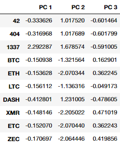

# Cryptocurrency Analysis - Unsupervised Machine Learning

## Challenge

### Deliverable 1 - Transforming Data

In deliverable 1 we read in the cryptocurrency dataset and started our transformation and preparation of the data for the modelling. We filtered teh currencies with the following criteria:

* Currencies are being traded.
* Currencies have a listed algorithm.
* Currencies have mined coins.

We dropped unneeded string columns and ran the rest of the data through the `pd.get_dummies` function to turn the `Algorithm` and `ProofType` into numerical values. Once all the data was organised, we fit it to the `StandardScaler()` method, to get an array of scaled values.

<p align="center">

</p>

### Deliverable 2 - PCS Dimension Reduction

We use the `PCA` method to implement principal component analysis and reduce the number of columns in the scaled dataset from 98 to 3. **We were unable to match the PCA dataset provided in the challenge as no `random_state` was provided.** We then wrote this data to a DataFrame for use later. This was done with the following Python:

```py
# Using PCA to reduce dimension to three principal components.
pca = PCA(n_components=3, random_state=0)
crypto_pca = pca.fit_transform(X_scale)

# Create a DataFrame with the three principal components.
pcs_df = pd.DataFrame(data=crypto_pca, columns=['PC 1', 'PC 2', 'PC 3'], index=crypto_df.index)
```

Producing the DataFrame:

<p align="center">

</p>

### Deliverable 3 - K-Means Clusters

We needed to fit the data to a K-Means model, but first wanted to find the ideal number of clusters to use. To do this we use an Elbow Graph by comparing the number of clusters to the corresponding model inertia. This is done with:

```py
# Create an elbow curve to find the best value for K.
inertia = []
k = list(range(1, 11))

# Loop through K values.
for i in k:
    km = KMeans(n_clusters=i, random_state=0)
    km.fit(pcs_df)
    inertia.append(km.inertia_)

# Create DataFrame to store corresponding values.
df_inertia = pd.DataFrame({'k': k, 'inertia': inertia})
```

We use the `hvplot` module to plot the graph from the DataFrame we created.

```py
# Plot elbow graph.
df_inertia.hvplot.line(x='k', y='inertia', title='Elbow Chart', xticks='k')
```

<p align="center">

</p>

From the graph we learn that the ideal number of clusters is 4 - so we rerun the model with this value, and fit the PCA DataFrame to it, to get the predicted class values.

```py
# Initialize the K-Means model.
km = KMeans(n_clusters=4, random_state=8)

# Fit the model.
km.fit(pcs_df)

# Predict clusters.
pred = km.predict(pcs_df)
```

We then combine these predictions, along with the PCA DataFrame and the names of the different currencies together with the original pre-scaled DataFrame to get the following:

<p align="center">

</p>

### Deliverable 4

For the final deliverable, we first used the `plotly.express` module to render a 3D scatter plot from the full DataFrame we constructed in deliverable 3. This was done with:

```py
# Creating a 3D-Scatter with the PCA data and the clusters
fig = px.scatter_3d(
    clustered_df,
    x='PC 1',
    y='PC 2',
    z='PC 3',
    color='Class',
    symbol='Class',
    width=800,
    hover_name='CoinName',
    hover_data=['Algorithm']
)
fig.update_layout(legend=dict(x=0, y=1))
fig.show()
```

And produced the following plot, which we coloured and shaped by `Class`:

<p align="center">

</p>

We also used the `hvplot` module again to produce a graphical plot of the table with the columns we chose.

```py
# Create a table with tradable cryptocurrencies.
clustered_df.hvplot.table(columns=['CoinName', 'Algorithm', 'ProofType', 'TotalCoinSupply', 'TotalCoinsMined', 'Class'])
```

<p align="center">

</p>

For the final part of deliverable 4 we `fit_transform` the `TotalCoinSupply` and `TotalCoinsMined` columns to the `MinMaxScaler()`, and plot the scaled columns on a scatter graph, colouring by `Class`.

```py
# Scaling data to create the scatter plot with tradable cryptocurrencies.
c_mmscaler = MinMaxScaler().fit_transform(clustered_df[['TotalCoinSupply', 'TotalCoinsMined']])

# Create a new DataFrame that has the scaled data with the clustered_df DataFrame index.
plot_df = pd.DataFrame(data=c_mmscaler, columns=['TotalCoinSupply', 'TotalCoinsMined'], index=clustered_df.index)

# Add the "CoinName" column from the clustered_df DataFrame to the new DataFrame.
plot_df['CoinName'] = clustered_df['CoinName']

# Add the "Class" column from the clustered_df DataFrame to the new DataFrame.
plot_df['Class'] = clustered_df['Class']

# Create a hvplot.scatter plot using x="TotalCoinsMined" and y="TotalCoinSupply".
plot_df.hvplot.scatter(x='TotalCoinsMined', y='TotalCoinSupply', by='Class', hover_cols='CoinName')
```

Giving the final graph which is:

<p align="center">

</p>

## Context

This is the repo for Module 18 of the University of Toronto School of Continuing Studies Data Analysis Bootcamp Course - **Unsupervised Machine Learning with Cryptocurrencies** - Python. Following the guidance of the module we end up pushing this selection of files to GitHub.
